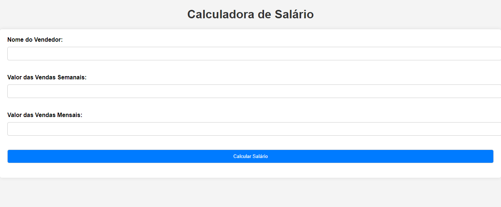
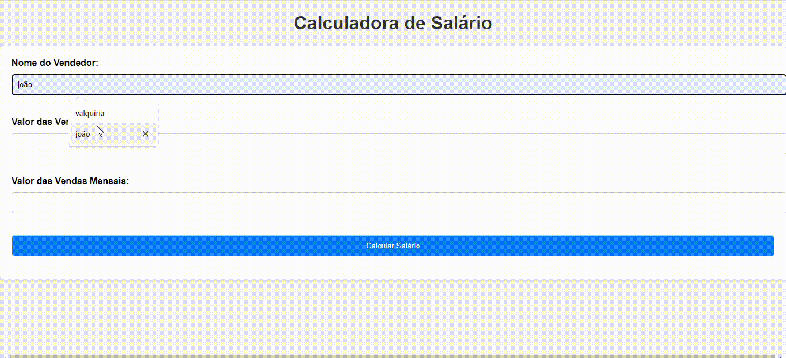

# indíce
[SISTEMA_SALARIO](#sistema_salario)  
[Descrição](#descrição)   
[Funcionalidades](#funcionalidades)  
[Autor](#autor)

# Sistema_salario

## Descrição
Sistema que solicita o nome do vendedor, os valores de meta semanal e mensal, e, ao final, o sistema deverá calcular o salário final e exibir ao usuário, para que o pagamento do salário seja efetuado.

## Funcionalidades

- Cadastro do Vendedor:
Solicitação do nome do vendedor para identificação no sistema.

- Definição de Metas:
Solicitação dos valores de meta semanal e mensal para o vendedor.

- Registro de Vendas:
Permitir o registro das vendas realizadas pelo vendedor ao longo do período (semanal ou mensal).
 
- Cálculo do Salário:
Com base nas vendas registradas e nas metas estabelecidas, o sistema calcula o salário final do vendedor.

- Exibição do Salário:
Apresentação ao usuário do valor do salário calculado, incluindo os detalhes dos bônus por atingir ou superar as metas.

()

## Autor ✍️
[Julia] https://github.com/juliaburque/Sistema_salario

